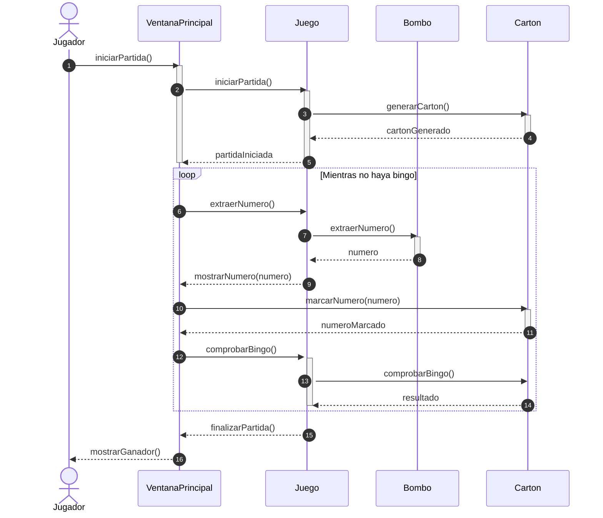

#  Diagrama de Secuencia del Juego de Bingo

Este diagrama muestra cómo se desarrolla una partida de bingo, detallando la interacción entre el **Jugador**, la **Ventana Principal**, el **Juego**, el **Bombo** y el **Cartón**.

---

## Actores y Participantes

1. **Jugador**: Usuario que inicia y participa en la partida. Interactúa con la interfaz para comenzar el juego y ver los resultados.  

2. **VentanaPrincipal**: Interfaz gráfica del juego.  
    - Muestra la partida y recibe las acciones del jugador.  
    - Envía solicitudes al **Juego** para iniciar la partida, extraer números y comprobar bingo.  
    - Marca los números en el **Cartón** y muestra el ganador al final.  

3. **Juego**: Controla la lógica interna del bingo.  
    - Inicia la partida y genera el **Cartón** del jugador mediante `generarCarton()`.  
    - Extrae números del **Bombo** y los envía a la **VentanaPrincipal**.  
    - Comprueba si hay bingo mediante `comprobarBingo()` consultando al **Cartón**.  
    - Finaliza la partida notificando a la **VentanaPrincipal**.  

4. **Bombo**: Contenedor de números.  
    - Proporciona números aleatorios cuando el **Juego** solicita `extraerNumero()`.  

5. **Cartón**: Representa el cartón del jugador.  
    - Genera el cartón inicial al inicio de la partida (`generarCarton()`).  
    - Marca los números extraídos (`marcarNumero(numero)`).  
    - Comprueba si se ha conseguido bingo (`comprobarBingo()`).  

---

##  Flujo de la Partida

### 1 Inicio de la partida

1. El **Jugador** solicita iniciar la partida (`iniciarPartida()`).  
2. La **VentanaPrincipal** envía la acción al **Juego**.  
3. El **Juego** genera el **Cartón** y notifica que la partida ha comenzado (`partidaIniciada`).  

### 2️ Desarrollo del juego (loop Mientras no haya bingo)

1. La **VentanaPrincipal** solicita al **Juego** extraer un número (`extraerNumero()`).  
2. El **Juego** obtiene un número del **Bombo** y lo devuelve a la **VentanaPrincipal**.  
3. La **VentanaPrincipal** muestra el número al jugador (`mostrarNumero(numero)`).  
4. El número se marca en el **Cartón** y se confirma (`numeroMarcado`).  
5. La **VentanaPrincipal** solicita al **Juego** comprobar si hay bingo.  
6. El **Juego** consulta al **Cartón** y obtiene el resultado (`resultado`).  
7. El ciclo se repite hasta que se consigue bingo.  

### 3️ Finalización de la partida

1. Una vez detectado el bingo, el **Juego** notifica a la **VentanaPrincipal** (`finalizarPartida()`).  
2. La **VentanaPrincipal** muestra al **Jugador** el ganador (`mostrarGanador()`).  

---

##  Notas Importantes

- Se usan **activaciones** (`activate` / `deactivate`) para indicar cuándo cada participante está realizando acciones.  
- El **loop** refleja la repetición del proceso de extraer y marcar números hasta que se consiga bingo.  
- La secuencia muestra claramente la **interacción entre la interfaz y la lógica del juego**, separando las responsabilidades de cada componente.
