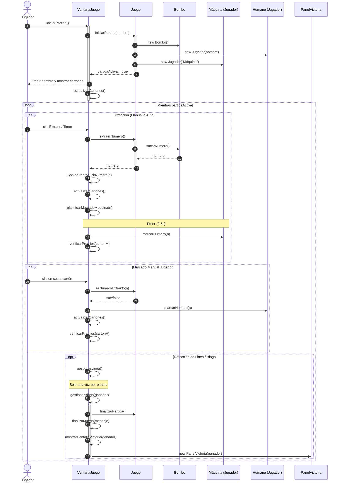

# Diagrama de Secuencia - Bingo POO

Este diagrama detalla cómo interactúan los objetos del sistema durante una partida, reflejando la arquitectura refactorada donde la **VentanaJuego** actúa como mediador principal y el objeto **Juego** gestiona el estado.

---

## Participantes y Roles

1.  **Jugador (Actor)**: El usuario que interactúa con la interfaz (clics, ajustes).
2.  **VentanaJuego**: El "cerebro" visual. Controla el flujo de la UI, gestiona los temporizadores (AUTO y Máquina) y sincroniza los paneles con los datos del modelo.
3.  **Juego**: El motor de la lógica (Model). Controla si la partida está activa, gestiona el bombo único y mantiene la lista de participantes.
4.  **Jugador (Clase Model)**: Representa a los competidores. Cada uno posee su propio `Carton`. Se usa tanto para el humano como para la "Máquina".
5.  **Bombo**: Implementa la lógica de extracción aleatoria sin repetición (1-90).
6.  **PanelVictoria**: Componente especial que aparece al finalizar con la animación del ganador.

---

## Flujo de Operaciones Principal

### 1. Inicialización de la Partida
Cuando el usuario pulsa "Iniciar", se dispara una cadena de creación: el `Juego` instancia el `Bombo` y los `Jugadores`. Cada jugador genera su `Carton` automáticamente. La `VentanaJuego` recibe la señal y actualiza todos los componentes visuales (`PanelCarton`, `Cabecera`, `Historial`).

### 2. El Ciclo de Extracción
El juego avanza mediante extracciones:
1.  Se pide un número al `Juego`, que lo saca del `Bombo`.
2.  La bola se muestra en grande y se añade al historial.
3.  **Simulación de IA**: La máquina no marca instantáneamente; la ventana usa un `Timer` para esperar unos segundos, haciendo que el juego se sienta más natural.

### 3. Interacción del Jugador
El marcado manual es una validación de reglas:
1.  Al clicar en un número, la ventana comprueba con el `Juego` si el número realmente ha salido.
2.  Si es así, se actualiza el `Carton` interno y el botón cambia de color.
3.  Si el jugador se equivoca, el sistema reacciona con un efecto visual de error (flash rojo).

### 4. Victoria y Cierre
Cuando alguien (Humano o Máquina) completa su cartón:
1.  `gestionarBingo` detiene todos los procesos automáticos.
2.  El `Juego` se marca como inactivo.
3.  Se detiene la música ambiental y suena el efecto de victoria.
4.  La ventana reemplaza todo el contenido por el `PanelVictoria`.

---

> **Nota**: Fíjate en el paso **38** (marcado de máquina). Este flujo demuestra cómo el **Encapsulamiento** protege los datos: el usuario nunca toca el cartón de la máquina, y la máquina solo marca lo que la lógica permite.
