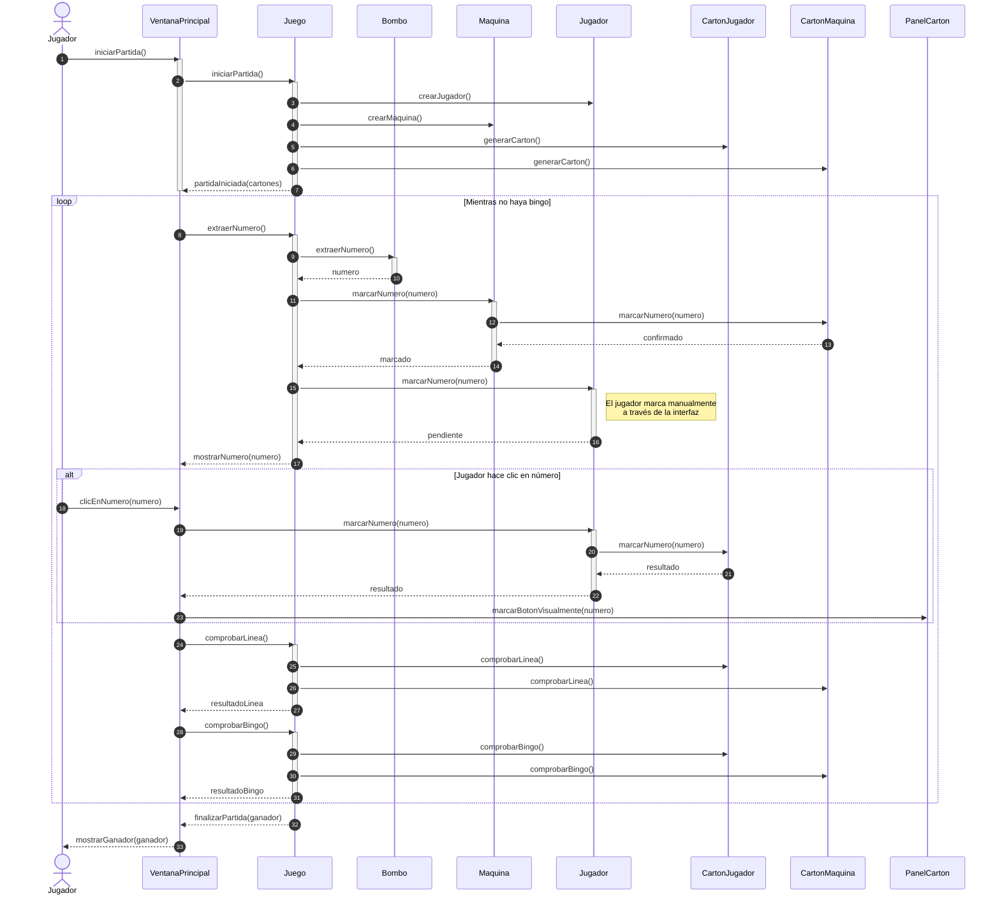

#  Diagrama de Secuencia del Juego de Bingo

Este diagrama muestra cómo se desarrolla una partida de bingo, detallando la interacción entre el **Jugador**, la **VentanaPrincipal**, el **Juego**, la **Máquina**, el **Bombo** y los **Cartones**.

---

## Actores y Participantes

1. **Jugador**: Usuario que inicia y participa en la partida. Interactúa con la interfaz para comenzar el juego, marcar números manualmente y ver los resultados.

2. **VentanaPrincipal**: Interfaz gráfica del juego.
    - Muestra la partida y recibe las acciones del jugador.
    - Envía solicitudes al **Juego** para iniciar la partida y extraer números.
    - Solicita a los **Participantes** (Jugador/Máquina) que marquen sus números.
    - Actualiza la vista de los cartones a través de **PanelCarton**.
    - Muestra mensajes de línea, bingo y ganador.

3. **Juego**: Controla la lógica interna del bingo.
    - Inicia la partida creando los participantes y sus cartones.
    - Extrae números del **Bombo** y notifica a todos los participantes.
    - Coordina las comprobaciones de línea y bingo.
    - Finaliza la partida cuando hay un ganador.

4. **Máquina**: Participante controlado por el sistema.
    - Recibe notificación de números extraídos.
    - Marca automáticamente en su cartón si tiene el número.

5. **Jugador (clase)**: Participante humano.
    - Recibe notificación de números extraídos.
    - Espera a que el usuario haga clic para marcar el número.
    - Valida y ejecuta el marcado en su cartón.

6. **Bombo**: Contenedor de números.
    - Proporciona números aleatorios sin repetición cuando el **Juego** solicita `extraerNumero()`.

7. **Cartón**: Representa el cartón de un participante.
    - Genera números aleatorios al inicio (`generarCarton()`).
    - Contiene la lógica de marcado (`marcarNumero()`).
    - Comprueba línea (`comprobarLinea()`) y bingo (`comprobarBingo()`).

---

##  Flujo de la Partida

### 1 Inicio de la partida

1. El **Jugador** solicita iniciar la partida (`iniciarPartida()`).
2. La **VentanaPrincipal** envía la solicitud al **Juego**.
3. El **Juego** crea las instancias de **Jugador** y **Máquina**.
4. El **Juego** solicita a cada participante generar su **Cartón** (`generarCarton()`).
5. El **Juego** notifica a la **VentanaPrincipal** que la partida ha iniciado (`partidaIniciada`).
6. La **VentanaPrincipal** muestra los cartones en pantalla a través de **PanelCarton**.

### 2️ Desarrollo del juego (loop Mientras no haya bingo)

1. La **VentanaPrincipal** solicita al **Juego** extraer un número (`extraerNumero()`).
2. El **Juego** obtiene un número del **Bombo** (`extraerNumero()`).
3. El **Bombo** devuelve el número extraído al **Juego**.
4. El **Juego** notifica a la **Máquina** del nuevo número (`marcarNumero(numero)`).
5. La **Máquina** verifica si tiene el número en su **Cartón** (`contieneNumero()`).
6. Si lo tiene, la **Máquina** marca el número en su **Cartón** (`marcarNumero()`).
7. El **Juego** notifica al **Jugador** del nuevo número (`marcarNumero(numero)`).
8. El **Jugador** queda en espera de que el usuario haga clic (validación pendiente).
9. El **Juego** devuelve el número a la **VentanaPrincipal** (`mostrarNumero(numero)`).
10. La **VentanaPrincipal** actualiza el número actual y el historial.

**Marcado manual por el usuario:**

11. El **Jugador** (usuario) hace clic en un número de su cartón.
12. La **VentanaPrincipal** solicita al objeto **Jugador** (clase) que marque el número (`marcarNumero(numero)`).
13. El **Jugador** (clase) valida que el número haya sido extraído y pertenezca a su **Cartón**.
14. Si es válido, el **Jugador** marca el número en su **Cartón** (`marcarNumero()`).
15. El **Cartón** confirma el marcado al **Jugador**.
16. El **Jugador** confirma el resultado a la **VentanaPrincipal**.
17. La **VentanaPrincipal** solicita a **PanelCarton** actualizar la vista (`marcarBotonVisualmente()`).

**Comprobaciones de victoria:**

18. La **VentanaPrincipal** solicita al **Juego** comprobar línea (`comprobarLinea()`).
19. El **Juego** consulta al **Cartón** del **Jugador** y de la **Máquina**.
20. Si hay línea, el **Juego** devuelve el resultado a la **VentanaPrincipal**.
21. La **VentanaPrincipal** muestra mensaje informativo de línea (`mostrarMensajeLinea()`).

22. La **VentanaPrincipal** solicita al **Juego** comprobar bingo (`comprobarBingo()`).
23. El **Juego** consulta al **Cartón** del **Jugador** y de la **Máquina**.
24. El **Juego** devuelve el resultado a la **VentanaPrincipal**.
25. El ciclo se repite hasta que alguien consiga bingo.

### 3️ Finalización de la partida

1. Una vez detectado el bingo, el **Juego** notifica a la **VentanaPrincipal** (`finalizarPartida(ganador)`).
2. La **VentanaPrincipal** detiene el temporizador y muestra al **Jugador** el ganador (`mostrarGanador()`).
3. Se ofrece la opción de volver al menú principal o iniciar nueva partida.

---

##  Notas Importantes

- La **VentanaPrincipal** nunca accede directamente al **Cartón**. Siempre interactúa a través de los **Participantes** (Jugador/Máquina).
- La **Máquina** marca automáticamente sin intervención del usuario.
- El **Jugador** (clase) valida las reglas del negocio antes de permitir el marcado.
- **PanelCarton** es puramente visual y no contiene lógica de negocio.
- Las comprobaciones de línea y bingo se realizan después de cada marcado.
- El sistema mantiene separación de responsabilidades: la interfaz maneja eventos, el modelo maneja datos y reglas, y el controlador (Juego) coordina el flujo.
