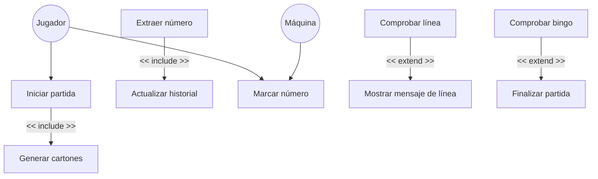

# Diagrama de Casos de Uso – Juego Bingo

# Explicación del Diagrama de Casos de Uso

## Actores del Sistema

### **Jugador**
Es el usuario que interactúa con el juego. Puede **iniciar la partida** y **marcar manualmente los números** que aparecen en su cartón cuando estos han sido extraídos por el sistema.

### **Máquina**
Representa al oponente controlado por el sistema. También participa en la partida y **marca automáticamente los números** que aparecen en su cartón cuando son extraídos.

---

## Casos de Uso Principales

### **Iniciar partida**
Permite al jugador comenzar una **nueva partida de Bingo**. Cuando se inicia la partida, el sistema prepara todos los elementos necesarios para el juego.

### **Generar cartones**
Este caso de uso se ejecuta automáticamente al iniciar la partida. El sistema crea de forma **aleatoria un cartón para el jugador y otro para la máquina**.

**Relación utilizada:** `<<include>>`  
Esto significa que **siempre que se inicia una partida se generan los cartones**.

---

### **Extraer número**
El sistema extrae automáticamente un número del bombo **cada cierto intervalo de tiempo**. Los números extraídos **no pueden repetirse**.

### **Actualizar historial**
Cada número extraído se guarda en un **historial** que permite al jugador ver los números que ya han salido durante la partida.

**Relación utilizada:** `<<include>>`  
Esto significa que **cada vez que se extrae un número, también se actualiza el historial**.

---

### **Marcar número**
Cuando aparece un número extraído, el **jugador puede marcarlo manualmente** en su cartón si lo tiene.  

La **máquina realiza esta acción automáticamente**.

---

### **Comprobar línea**
El sistema verifica si alguno de los participantes ha **completado una fila en su cartón**.

### **Mostrar mensaje de línea**
Si se detecta una línea, el sistema muestra un **mensaje informativo al jugador**.

**Relación utilizada:** `<<extend>>`  
Esto significa que **solo ocurre cuando se cumple la condición de tener una línea**.

---

### **Comprobar bingo**
Después de cada número extraído, el sistema verifica si alguno de los participantes ha **completado todos los números de su cartón**.

### **Finalizar partida**
Si se detecta un **bingo**, el juego termina y se muestra el ganador.

**Relación utilizada:** `<<extend>>`  
Esto significa que **solo se ejecuta cuando alguien consigue bingo**.

---

## Resumen del Funcionamiento

El **jugador inicia la partida** y el sistema **genera automáticamente los cartones**.  

A partir de ese momento, el juego comienza a **extraer números del bombo de forma automática**.

Cada número extraído puede ser **marcado por el jugador en su cartón** y **automáticamente por la máquina**.

Después de cada extracción, el sistema **comprueba si se ha completado una línea o un bingo**.

Cuando un participante consigue **bingo**, la partida **finaliza y se declara un ganador**.
