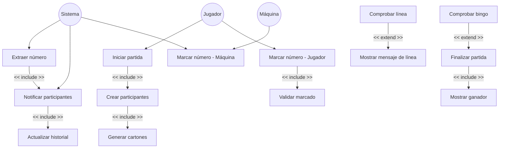

# Diagrama de Casos de Uso – Juego Bingo

# Explicación del Diagrama de Casos de Uso

## Actores del Sistema

### **Jugador**
Es el usuario que interactúa con el juego. Puede **iniciar la partida** y **marcar manualmente los números** que aparecen en su cartón cuando estos han sido extraídos por el sistema. El marcado se realiza haciendo clic en el número correspondiente de su cartón.

### **Máquina**
Representa al oponente controlado por el sistema. Participa en la partida y **marca automáticamente los números** que aparecen en su cartón cuando son extraídos y notificados por el sistema.

### **Sistema**
Representa la lógica interna del juego que ejecuta acciones automáticas: extrae números del bombo, notifica a los participantes, actualiza el historial y controla el temporizador.

---

## Casos de Uso Principales

### **Iniciar partida**
Permite al jugador comenzar una **nueva partida de Bingo**. Cuando se inicia la partida, el sistema prepara todos los elementos necesarios para el juego.

### **Crear participantes**
El sistema crea las instancias de **Jugador** y **Máquina**, asignando a cada uno un nombre y preparando su estructura interna.

**Relación utilizada:** `&lt;&lt;include&gt;&gt;`  
Esto significa que **siempre que se inicia una partida se crean los participantes**.

### **Generar cartones**
Este caso de uso se ejecuta automáticamente al crear los participantes. Cada participante genera de forma **aleatoria su propio cartón** con 15 números distribuidos en formato 3x9.

**Relación utilizada:** `&lt;&lt;include&gt;&gt;`  
Esto significa que **siempre que se crean los participantes se generan sus cartones**.

---

### **Extraer número**
El **Sistema** extrae automáticamente un número del bombo **cada cierto intervalo de tiempo** (4 segundos). Los números extraídos **no pueden repetirse**.

### **Notificar participantes**
Cada número extraído es **notificado a ambos participantes** (Jugador y Máquina) para que puedan marcarlo en sus cartones si lo tienen.

**Relación utilizada:** `&lt;&lt;include&gt;&gt;`  
Esto significa que **cada vez que se extrae un número, se notifica a los participantes**.

### **Actualizar historial**
Cada número extraído se guarda en un **historial visible** que permite al jugador ver los números que ya han salido durante la partida.

**Relación utilizada:** `&lt;&lt;include&gt;&gt;`  
Esto significa que **cada vez que se notifica a los participantes, también se actualiza el historial**.

---

### **Marcar número - Jugador**
Cuando el **Jugador** recibe la notificación de un nuevo número, puede **marcarlo manualmente** haciendo clic en el número de su cartón. La interfaz solicita al objeto Jugador que ejecute el marcado.

### **Marcar número - Máquina**
Cuando la **Máquina** recibe la notificación de un nuevo número, **marca automáticamente** si el número está en su cartón, sin intervención del usuario.

### **Validar marcado**
Antes de permitir el marcado, el sistema valida:
- Que el número haya sido extraído previamente
- Que el número pertenezca al cartón del jugador
- Que el número no esté ya marcado

Si no cumple las condiciones, se muestra un mensaje de error.

**Relación utilizada:** `&lt;&lt;include&gt;&gt;`  
Esto significa que **cada vez que el jugador intenta marcar, se validan las condiciones**.

---

### **Comprobar línea**
El sistema verifica si alguno de los participantes ha **completado una fila en su cartón** después de cada marcado.

### **Mostrar mensaje de línea**
Si se detecta una línea, el sistema muestra un **mensaje informativo al jugador** indicando quién la consiguió.

**Relación utilizada:** `&lt;&lt;extend&gt;&gt;`  
Esto significa que **solo ocurre cuando se cumple la condición de tener una línea**.

---

### **Comprobar bingo**
Después de cada marcado, el sistema verifica si alguno de los participantes ha **completado todos los números de su cartón**.

### **Finalizar partida**
Si se detecta un **bingo**, el juego termina inmediatamente.

**Relación utilizada:** `&lt;&lt;extend&gt;&gt;`  
Esto significa que **solo se ejecuta cuando alguien consigue bingo**.

### **Mostrar ganador**
Al finalizar la partida, se muestra un **mensaje con el nombre del ganador** y la opción de volver al menú principal.

**Relación utilizada:** `&lt;&lt;include&gt;&gt;`  
Esto significa que **siempre que finaliza la partida se muestra el ganador**.

---

## Resumen del Funcionamiento

El **jugador inicia la partida** y el sistema **crea los participantes y genera sus cartones automáticamente**.

A partir de ese momento, el **sistema extrae números del bombo de forma automática** y **notifica a ambos participantes**.

La **máquina marca automáticamente** los números en su cartón, mientras que el **jugador debe hacer clic para marcar manualmente**.

Antes de cada marcado del jugador, el sistema **valida que se cumplan las reglas**.

Después de cada marcado, el sistema **comprueba si se ha completado una línea o un bingo**.

Cuando un participante consigue **bingo**, la partida **finaliza, se muestra el ganador** y se ofrece la opción de reiniciar.
